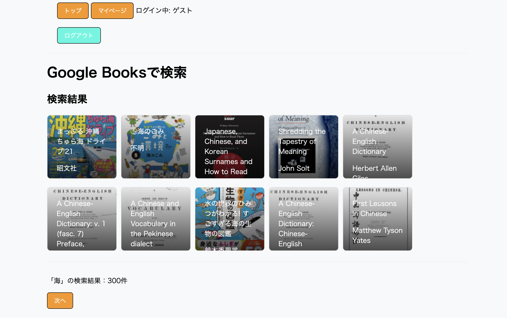
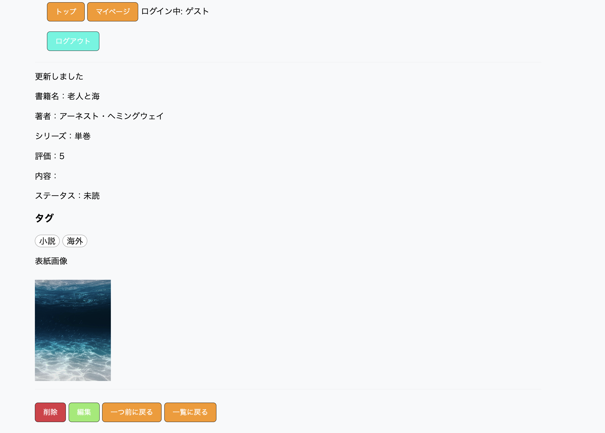
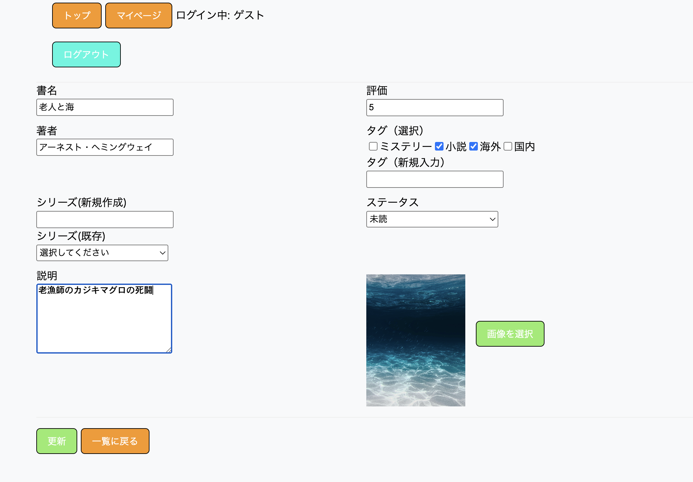

書籍管理アプリ

▫️アプリ概要  
本アプリは、書籍を管理するためのWebアプリです。  
書籍の登録・編集・削除に加え、シリーズ管理やタグ機能、読書履歴の管理ができます。  
また、検索機能や外部APIを利用した書籍検索機能を実装しています。 

▫️作成の背景  
所有している書籍が増えすぎて管理しきれなくなったため、本アプリを作成しました。  
また、読書履歴や検索機能を通じて読書傾向を可視化し、今後の書籍選びに活かすことを目的としています。

▫️本番環境URL
https://book-app-2-vmsy.onrender.com

▫️主な機能  
・ユーザー機能
- ユーザー登録/ログイン機能
- ゲストユーザー機能（ログインなしでも体験可能）
- ゲストユーザーの権限制御（編集・マイページ制限）

・書籍機能
- 書籍の登録・編集・削除
- 書籍の一覧表示（検索可能）
- 読書履歴の管理

・関連機能
- シリーズ管理（新規作成 / 既存選択 / 単巻対応）
- タグ機能（複数登録対応）
- 検索機能（フリーワード・タグ検索）

・外部API検索機能
- 外部APIを利用した書籍検索機能

▫️使用技術  
- Ruby
- Ruby on Rails
- PostgreSQL
- JavaScript
- HTML / CSS
- Docker（開発環境）
- Render（本番環境）
- Active Storage
- Cloudinary

▫️工夫した点  
- ゲストユーザー機能を実装し、ログインなしでもアプリ体験が可能になるよう設計
- ゲストユーザーには編集・マイページ機能を制限し、権限制御を実装
- シリーズ未選択時は「単巻」として扱う設計にし、データはnil管理・表示はUI変換で対応
- 入力エラー時に該当フォームをハイライトし、ユーザーが修正箇所を直感的に理解できるよう改善
- 外部APIを利用した検索機能を実装し、検索体験を拡張
- Active Storageによる画像アップロード機能を実装

▫️解決した課題
- 画像更新時にデータが破損する問題  
  → attachとpurgeの処理順を見直して解決

- DoubleRenderErrorの発生  
  → redirect_toの重複呼び出しを修正

- フォームのfile_fieldが表示されない問題  
  → form構造を修正し解決

▫️アプリ画面
・書籍一覧（index）
- 検索・一覧表示を統合し、ユーザーが直感的に目的の書籍へアクセスできるよう設計しています。

  

・検索機能（search）
- フリーワードおよびタグ検索により、目的の書籍を効率的に絞り込めます。

  

・外部API検索（api-search）
- 外部APIを利用し、書籍情報を取得できる検索機能を実装しています。

  

・書籍詳細（show）
- 書籍の詳細情報、シリーズ、タグなどを確認できます。

  

・書籍編集（edit）
- 登録済み書籍の情報を編集できます。

  

▫️今後の改善予定
- UIデザインの改善
- 検索機能の強化（AND検索・並び替え）
- UX改善項目として、画像アップロード時のリアルタイムプレビュー機能
- テストコードの追加
- 本番環境での画像保存をS3へ移行
